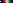
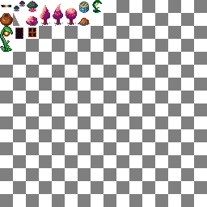
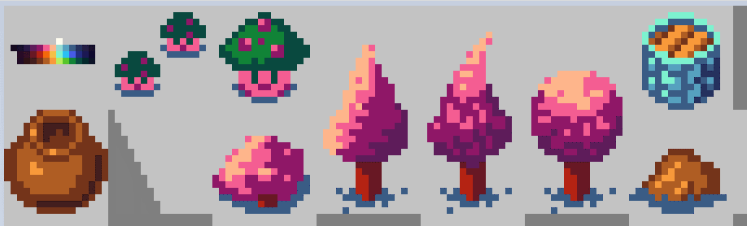
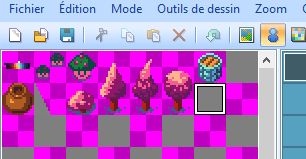
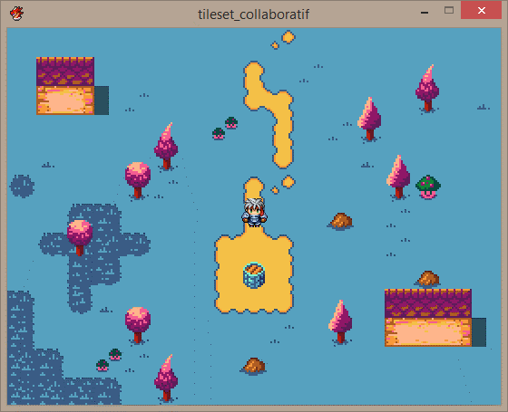

# Le tileset collaboratif de RMA

Le tileset collaboratif est un projet des membres de la communauté [RPG Maker Alliance](https://rpgmakeralliance.com/). L'objectif est de réaliser collectivement des ressources graphiques pour RPG Maker, qui seront ensuite diffusées gratuitement, tout comme le [RPG Maker Starter Pack](https://wiki.rpgmakeralliance.com/starterpack).

Les graphismes répondent à plusieurs contraintes :

- Utilisation d'une palette de couleurs limitées
- Tiles de 16×16 pixels. Le tileset doit être adaptable aux logiciels RPG Maker.

Pour rejoindre le projet, rendez-vous [sur Discord](https://discordapp.com/invite/RrBppaj), et demandez à un modérateur de vous ajouter au channel de discussion #tileset-collaboratif.

# La palette

# Le tileset

## A2

## A3

## A5

## B

# Utiliser le projet VX Ace

## 1. Modifiez le tileset

Vous êtes un artiste. Un vrai de vrai. Alors vous allez ouvrir l’un des fichiers dans `tileset_collaboratif/Graphics/Tilesets` et laisser parler votre inspiration soudaine en utilisant votre logiciel favori : Photoshop, Krita, Paint.Net…

Il va de soi que les fichiers dont le nom commence par PASTOUCHE, ben, il faut pas y toucher.

Par exemple, allez hop je rajoute un rocher sur `Kustom_B` (en bas à droite):

## 2. Mappez !

Ouvrez le projet dans RPG Maker VX Ace, une map est déjà présente. Mappez comme d’habitude.

Les modifications que vous aurez apportées au tileset ne seront malheureusement pas visibles sur la fenêtre de gauche :

*Meh, mon rocher n’apparaît pas !*

Cela n’est pas grave ! Vous connaissez la case sur laquelle votre rocher est censé apparaître, donc utilisez cette case et rajoutez-la sur votre map :

*Je vais donc ajouter cette case sur la map !*

## 3. Testez !

Testez le jeu et OH MIRACLE bien que votre rocher ne soit pas visible dans l’éditeur, il est bel et bien visible en jeu !

*Mes rochers sont bien là :ooo QUELLE EST CETTE MAGIE*

C'est tout !

- Si vous voulez créer une autre map, dupliquez la map actuelle 😊 Ainsi vous êtes sûr d’utiliser le bon tileset et d’avoir l’event magique.
- De temps en temps, ce serait cool qu’un bon samaritain mette à jour toutes les images `PASTOUCHE`, pour faire apparaître les derniers ajouts dans l’éditeur.

---

 This work is licensed under a <a rel="license" href="http://creativecommons.org/licenses/by-sa/4.0/">Creative Commons Attribution-ShareAlike 4.0 International License</a>.
