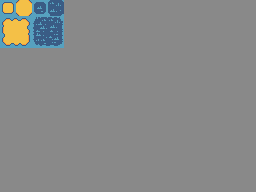
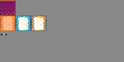
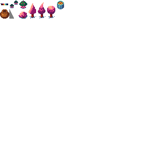

# Le tileset collaboratif de RMA

Le tileset collaboratif est un projet des membres de la communauté [RPG Maker Alliance](https://rpgmakeralliance.com/). L'objectif est de réaliser collectivement des ressources graphiques pour RPG Maker, qui seront ensuite diffusées gratuitement, tout comme le [RPG Maker Starter Pack](https://wiki.rpgmakeralliance.com/starterpack).

Les graphismes répondent à plusieurs contraintes :

- Utilisation d'une palette de couleurs limitées
- Tiles de 16×16 pixels. Le tileset doit être adaptable aux logiciels RPG Maker.

Pour rejoindre le projet, rendez-vous [sur Discord](https://discordapp.com/invite/RrBppaj), et demandez à un modérateur de vous ajouter au channel de discussion #tileset-collaboratif.

# La palette

# Le tileset

## A2

## A3

## A5

## B

---

 This work is licensed under a <a rel="license" href="http://creativecommons.org/licenses/by-sa/4.0/">Creative Commons Attribution-ShareAlike 4.0 International License</a>.
